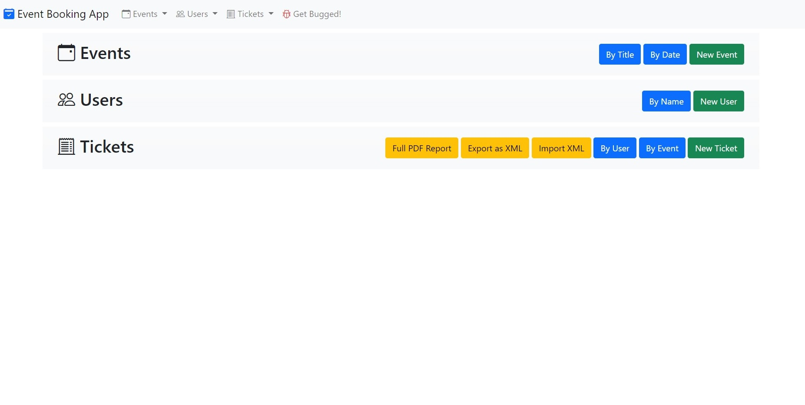

## Even Booking App

This Spring application runs MVC website locally, it manages events, tickets and users, you can CRUD all of these entities, book tickets, do specific search on events or users. it also allows to display tickets on PDF, XML, and import XML ticket batch.

It also exposes REST APIs, folder with **Postman Collections** show all requests that can be made. Documentation is also available after running the application on SwaggerUI, **localhost:8080/swagger-ui/**. note that there are two groups of definitions for REST and MVC controllers

App is highy abstracted and uses facade to reach internal methods

Please note this was part of training, and was not meant to a fully working and fully tested product rather a demonstration of skill thats why some functionality would be skipped as detailed below

The app allows to save data:
1. **Locally:** on a custom hashmap (complete integeration)
2. **DB:** app is setup to work with postgres DB, you might need to edit application.propeties to make it work with your local instance. i have included a script to populate tables on db (**db setup** folder)

to toggle between the two modes:
change the boolean of **app.localData** set in application.properties

This document is just a abstract guide, not meant to point out features. please check code for proper feel.

Project Includes:
- Making responsive MVC website, using Thymeleaf fragments(components) and Bootstrap
- Data Storage
	- Local HashMap (in memory)(fully functional according to requirements) 
	- Postgres  (functional with archit. limitations)(full limitation will be done in a project fork incl Spring Security) 
	- toggled using property app.localData=true/false
- Aspect Oriented Programming: 
	- logging
	- saving to localDB
- Spring Data 
- Spring Rest API
- Unit Tests with Spring 
- Cucumber Integration Testing (%100 local storage, DB storage some failing due to some unimplemented features, check commit for further details)
	- MockMvc for API Controllers
	- Selenium for MVC web access 
- SwaggerUI integration